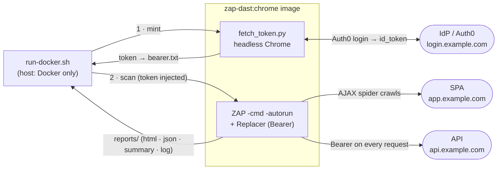

# zap-dast — authenticated ZAP DAST (Docker)

Config-driven OWASP ZAP DAST for **token-based SPAs** (a JWT in `localStorage`, sent as a Bearer
header). One command mints a fresh auth token and runs an authenticated AJAX spider + active scan
against your app + API, then writes timestamped reports. Point it at any such app via `target.env`
(`target.env.example` ships with generic `example.com` placeholders to fill in).

## Auth model (why this needs special handling)
These SPAs keep the session as a **JWT in browser `localStorage`**, sent as
`Authorization: Bearer <token>` to the API — *not* a cookie. ZAP can't read a localStorage token,
so we **fetch-then-inject**:

1. `fetch_token.py` performs the real headless-Chrome login and reads the token from `localStorage`.
2. ZAP runs with a **Replacer** rule that adds the auth header to every request.

The AJAX spider additionally logs in (Chrome browser-auth) to crawl the authenticated SPA.

Scope (all set in `target.env`): the **app** origin + **API** origin are scanned; the **IdP/login**
origin (e.g. Auth0) is used for login only and kept **out of scan scope**. For example:
`app.example.com` (SPA), `api.example.com` (API — primary target), `login.example.com` (IdP, login-only).

## Architecture


## Files
| File | Purpose |
|------|---------|
| `run-docker.sh` | Entry point: sources `target.env`, mints the token, runs the scan, writes reports |
| `target.env.example` | Config template — copy to `target.env` and fill in your app's values |
| `zap-dast.yaml` | ZAP Automation Framework plan (scope, auth, jobs, reports); `${VAR}`s filled from `target.env` |
| `zap-dast-quick.yaml` | Short plan (1-min spider + 1-min active scan) for smoke tests |
| `Dockerfile.zap-chrome` | ZAP stable + Chromium + Selenium (used for both the spider and the token mint) |
| `fetch_token.py` | Headless browser login → outputs the Bearer token |
| `discover.py` | Optional setup helper: records a manual login and drafts `target.env` for you |
| `reports/` | Timestamped outputs |
| `bin/` | Archived diagnostics + the old native (non-Docker) scripts |

## Prerequisites
**Docker is the only host requirement** — Python, Selenium and Chromium all live inside the
image. The first run auto-builds `zap-dast:chrome` (ZAP base + Chromium). Give the machine
enough RAM: **≥ 8 GB** for the Docker VM (on WSL2 set `~/.wslconfig`), or a starved VM thrashes.

## Configure
Copy the template and fill in your app's values (the file documents where to find each one in
browser DevTools — ~10 min, one-time):
```bash
cp target.env.example target.env
# then edit target.env: APP_URL, API_URL, login URL + selectors, token key, verify endpoint, …
```

### Or bootstrap it with `discover.py` (optional)
Instead of hunting through DevTools, let a helper record a real login and draft the config. Runs
on your **host** (a visible browser opens — not headless/Docker); the only dependency is Selenium:
```bash
pip install selenium
python discover.py https://your-app.example.com/landing   # the page with the Log In button
```
Log in normally in the window that opens, press Enter, and it writes **`target.env.discovered`**
(it never touches your real `target.env`). It auto-detects the login selectors, token key, API
origin + auth header, and a candidate verify endpoint — review the `# TODO` lines for anything it
couldn't nail, then `cp target.env.discovered target.env`.

## Usage
```bash
export ZAP_AUTH_USER="<login-email>"   # the login your app expects (any domain; not tied to Gmail)
export ZAP_AUTH_PASS="<password>"

./run-docker.sh                                       # full authenticated scan (~35–40 min)
ZAP_PLAN=zap-dast-quick.yaml ./run-docker.sh   # ~4-min smoke test
ZAP_DETAILED=1 ./run-docker.sh                        # + heavy request/response HTML report
ZAP_LOWMEM=0 ./run-docker.sh                          # force low-memory mode OFF (it auto-enables)
```
**Low-memory mode is automatic** — if Docker has < 7 GiB the script prints `Low memory detected …
switching to low-memory mode` and caps ZAP's heap + single-threads the active scan so it still
completes (just slower). Force it with `ZAP_LOWMEM=1`/`0`.

Env vars: `ZAP_AUTH_USER`, `ZAP_AUTH_PASS` (required); `ZAP_PLAN`, `ZAP_IMAGE`, `ZAP_DETAILED`,
`ZAP_LOWMEM` (auto; `1`/`0` to force), `ZAP_XMX` (MB), `ZAP_SKIP_MEM_CHECK` (optional).
`bearer.txt` is reused while it has > 45 min of validity left, otherwise re-minted automatically.

## Outputs (in `reports/`, all timestamped `-<TS>`)
| Artifact | Contents |
|----------|----------|
| `scan-summary-<TS>.txt` | URLs discovered, spider/active-scan timings, **alert counts by risk**, token expiry |
| `<context>-zap-report-<TS>.html` | Human-readable findings |
| `<context>-zap-report-<TS>.json` | Machine-readable (CI thresholds / run-to-run diffing) |
| `scan-<TS>.log` | Full ZAP console output |

> Crawl stats (e.g. *URLs discovered*) are **not** in the HTML/JSON reports — those are
> findings-only. Look in `scan-summary-<TS>.txt` (or the log).

## CI notes
- ZAP exits **1 when the plan completes with findings** ("Automation plan succeeded!" still prints).
  That's *success-with-alerts*, not a failure — `run-docker.sh` handles it and returns 0.
- Store creds as CI secrets exposed as `ZAP_AUTH_USER` / `ZAP_AUTH_PASS`.
- Fail the build on your own threshold by parsing the JSON report or the summary's alert counts.
- The token step needs Chrome/Chromium; on a CI runner it runs inside the image, so the runner only needs Docker.

### Sample GitLab CI job
```yaml
# .gitlab-ci.yml
dast:
  stage: test
  image: docker:27
  services: [ docker:27-dind ]
  variables:
    DOCKER_TLS_CERTDIR: "/certs"
    ZAP_AUTH_USER: "$APP_LOGIN_USER"     # CI/CD → Variables (masked + protected)
    ZAP_AUTH_PASS: "$APP_LOGIN_PASS"
    # ZAP_IMAGE: "$CI_REGISTRY_IMAGE/zap-dast:chrome"   # see note below
  before_script:
    - apk add --no-cache bash coreutils  # bash + GNU date/base64 that run-docker.sh needs
  script:
    - cd autozap && ./run-docker.sh
  artifacts:
    when: always
    paths: [ autozap/reports/ ]          # HTML + JSON + summary + log
    expire_in: 30 days
  rules:
    - if: '$CI_PIPELINE_SOURCE == "schedule"'   # e.g. run it nightly
```
Notes:
- **Pre-build the image once** and push it to your registry, then set `ZAP_IMAGE` to skip the
  per-run build (the image is large). Otherwise the first job builds `zap-dast:chrome`.
- `run-docker.sh` returns **0 even with findings**. To gate the pipeline, add a step that parses
  `reports/<context>-zap-report-*.json` (or the summary's alert counts) and fails on your threshold.

## Troubleshooting

**`session not created: Chrome instance exited` / Chrome exits with code 133 (SIGTRAP).**
Debian's unpinned `apt` Chromium drifted to a build (150) that crashes on launch inside a
container — it fails on native-Linux Docker regardless of RAM, headless mode, seccomp, or
Chrome flags. The image therefore pins **Chrome-for-Testing** (see `Dockerfile.zap-chrome`,
`CFT_VERSION`). If it resurfaces after a browser bump, pin `CFT_VERSION` to a known-good build
from <https://googlechromelabs.github.io/chrome-for-testing/> and rebuild:
```bash
docker build -f Dockerfile.zap-chrome -t zap-dast:chrome .
# quick check — both should print the same 149.x version:
docker run --rm zap-dast:chrome sh -c 'chromium --version; chromedriver --version'
```

**Scan ends with code 137 (or the mint/scan dies on a small box).** `137 = SIGKILL` — ZAP was
OOM-killed, usually mid active-scan. The script now prints `OOMKilled=true/false` to confirm.
The memory that matters is what the **container** sees (`docker info --format '{{.MemTotal}}'`),
**not** the host's RAM: on a VM or Docker Desktop that's the VM's allocation. A full active scan
wants **≥ 8 GB**. Two fixes:
- **Give Docker more memory** — WSL: `~/.wslconfig` `memory=16GB` then `wsl --shutdown`;
  Docker Desktop: Settings → Resources → Memory; a plain VM: raise its RAM.
- **Or let it shrink itself** — below 7 GiB the script **auto-switches to low-memory mode** (caps
  the JVM heap via `ZAP_XMX`, default 1024 MB, and single-threads the active scan). Force with
  `ZAP_LOWMEM=1`/`0`. Below ~4 GiB even the browser step may not fit, so add memory there.
